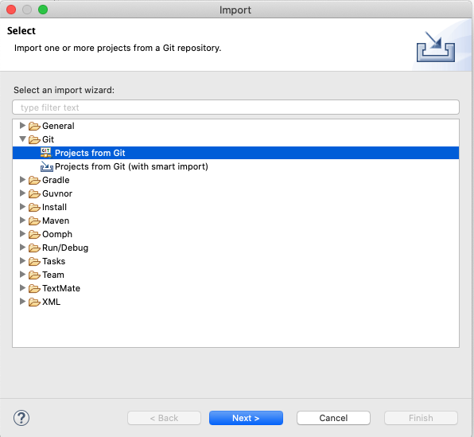
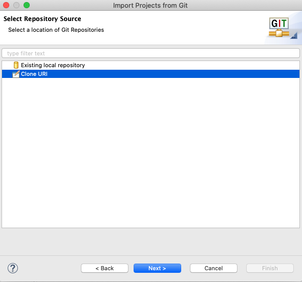
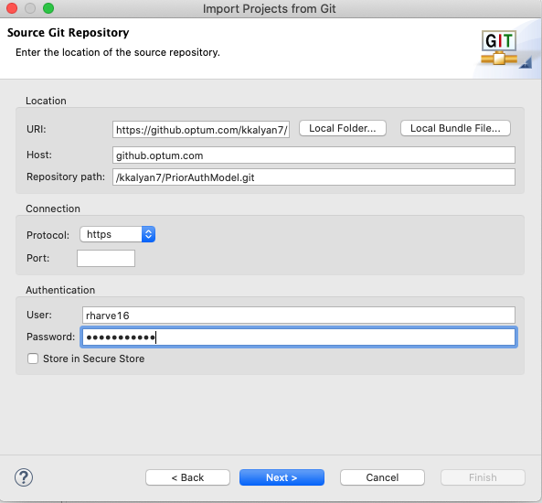
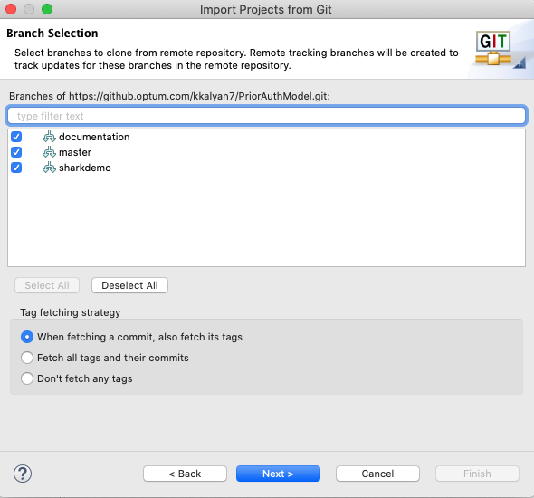
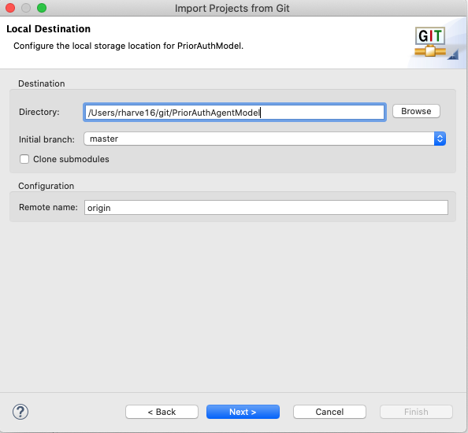
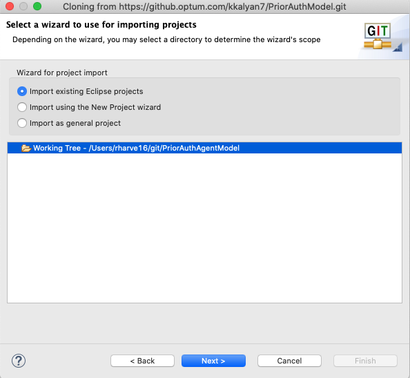
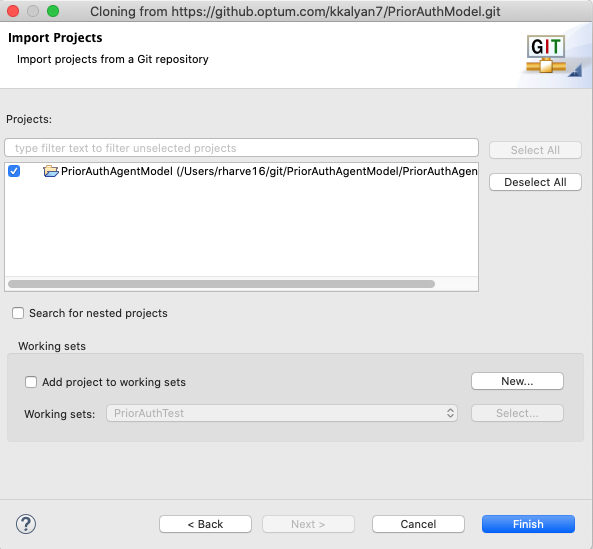
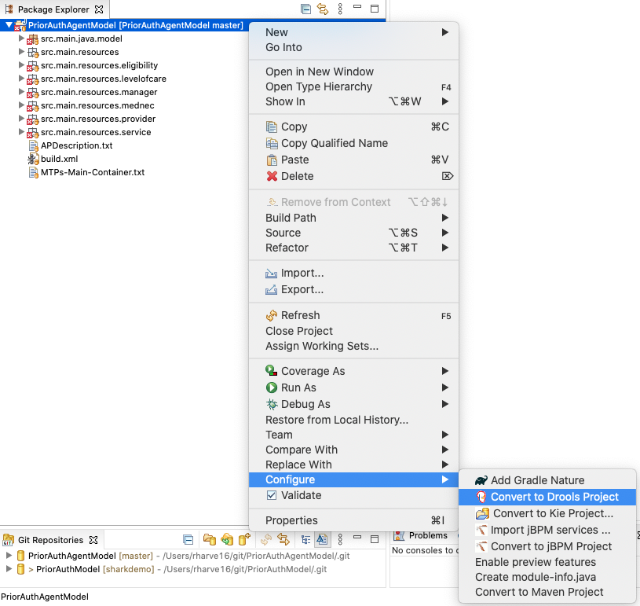
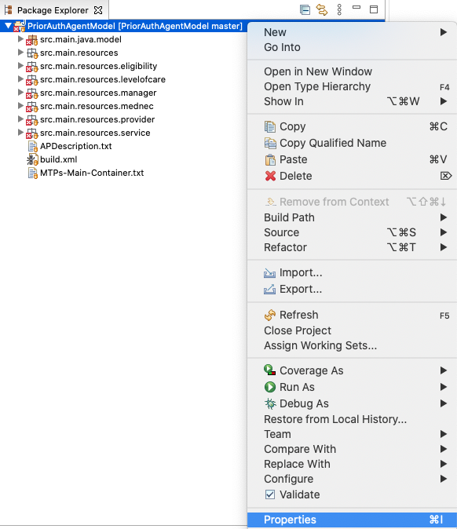
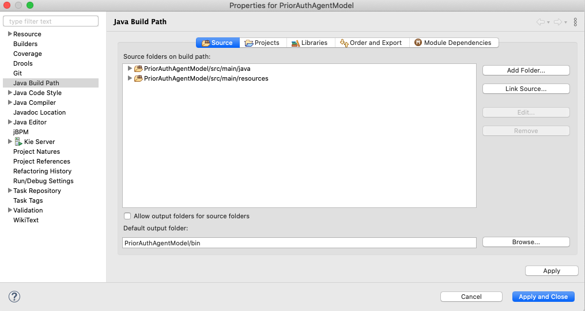

# Development Environment Setup

## Requirements
1. Install JADE. [Download zip](https://jade.tilab.com/dl.php?file=JADE-bin-4.5.0.zip) (Version 4.5.0). Unzip using `jar xvf JADE-bin-4.5.0.zip`.
2. Install [Eclipse](https://www.eclipse.org/downloads/) 
3. Install Drools. [Download zip](https://download.jboss.org/drools/release/6.5.0.Final/droolsjbpm-tools-distribution-6.5.0.Final.zip) (Drools and jBPM tools 6.5.0). Unzip using `jar xvf droolsjbpm-tools-distribution-6.5.0.Final.zip`. Make sure to install Drools in Eclipse ([Tutorial](https://www.tutorialspoint.com/drools/drools_eclipse_plugin.htm)) and install Drools runtime within eclipse ([Tutorial](https://www.tutorialspoint.com/drools/drools_runtime.htm)).


## Clone Repo Into Eclipse
1. [Code repo](https://github.optum.com/kkalyan7/PriorAuthModel)


2. **Import project from git**










3. **Set build path**



First, convert the project to a Drools project.



Open Properties menu to configure build path.



Remove the existing source folder and add `src/main/java` and `src/main/resources` as source folders.


Drools Library should already be in the classpath if project was converted correctly. Add jade.jar into the classpath as an external jar. Add JRE if missing.
Click Apply and Close.

4. **Set run configurations**
    
    Create a new run configuration. Set Main class to `jade.Boot` this is reguired for any Jade run configuration. Arguments can be customized as needed. Currently, the following arguments are used to start the demo:
    
    ```-gui -container-name "PriorAuth" -agents 'Facility:model.FacilityAgent;Manager:model.ManagerAgent;Eligibility:model.EligibilityAgent;Providers:model.ProviderAgent;Service:model.ServiceAgent;LevelOfCare:model.LevelOfCareAgent;MedNec:model.MedNecAgent;sniffer:jade.tools.sniffer.Sniffer;snifferstarter:util.SnifferStarter'```


## Helpful Resources

### Jade
Tutorials: https://jade.tilab.com/documentation/tutorials-guides/ 

Docs: https://jade.tilab.com/doc/api/index.html 

Setup: https://www.youtube.com/watch?v=-dFx1_XBGVI

### Drools
Tutorial: https://nicolas-heron.gitbook.io/droolsonboarding/ 

Community Docs: https://docs.jboss.org/drools/release/5.2.0.Final/drools-expert-docs/html/ 
    
Setup: https://www.youtube.com/watch?v=bmLG5QqGdsQ
